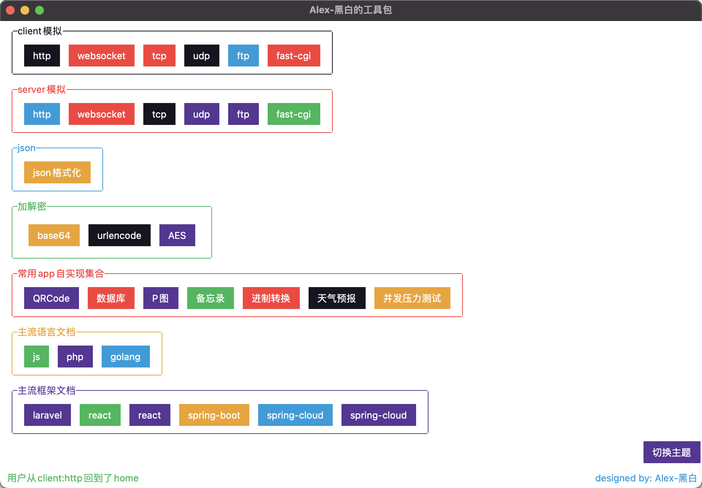
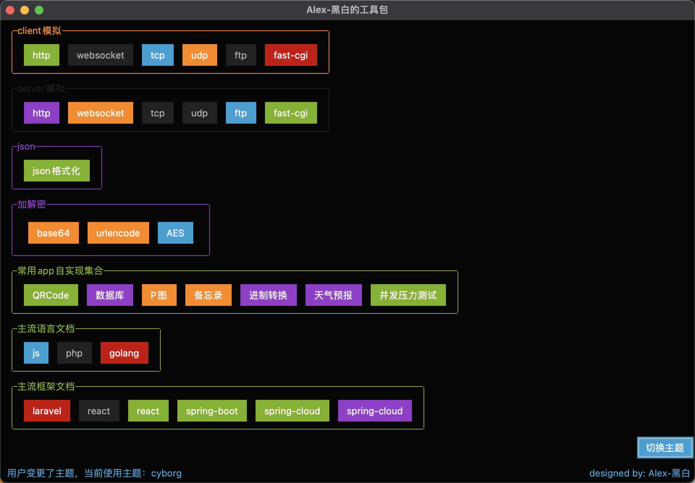

# DEVTool
Cross-platform toolkits for developers, include client and server for manual protocol,

QRCode, database tool, image diy, content editor,weather tool, api benchmark,doc, and so on......

### sample

- ##### daytime

- ##### Night time

##### timeline

###### 2022-09-20 : proj init
###### 2022-09-22 : finished basic http-client
###### 2022-10-28 : re-construct